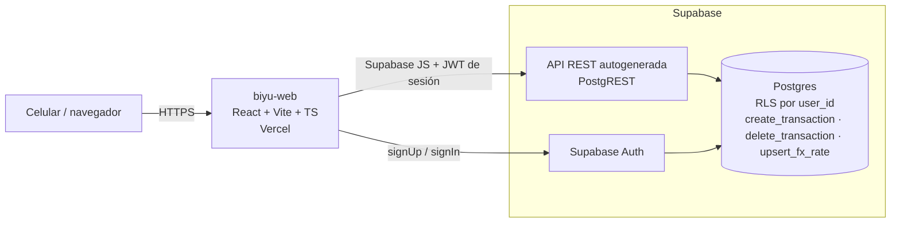

# Biyu · Resumen de estudio para la Entrega 1

Para poder explicar todo oralmente sin leer. Cada número de este archivo sale de
`05-reporte-de-ejecucion.md` y de `ejecucion/resultados.json`, igual que las slides
(`06-presentacion.html`).

---

## 1. Qué es el proyecto, en 30 segundos

Biyu es una app web, pensada para el celular, de **control de gastos personales para Argentina**.
Resuelve tres cosas que las apps genéricas no modelan bien:

- **Dos monedas.** Un gasto en dólares se guarda con el tipo de cambio del momento y ese valor no
  cambia después.
- **Cuotas.** Una compra en 12 cuotas se reparte en 12 meses, y la suma de las cuotas da exacto el total.
- **Una pregunta.** El resumen del mes responde "¿en qué se me fue la plata?".

La cátedra evalúa el trabajo de calidad (requerimientos, historias, casos, ejecución, defectos, reportes),
no el código. La implementación con agentes de IA era obligatoria.

**Roadmap:**

| Versión | Contenido |
|---|---|
| **V1** (esta entrega) | Núcleo: acceso, configuración, registro, cuotas, dólares, resumen, baja lógica |
| V2 | Suscripciones, deudas compartidas, export CSV y no funcionales |
| V3 | Automatización de un subconjunto de casos, y la edición de transacciones |

## 2. Arquitectura

Hay un solo artefacto desplegable (el front en Vercel) y Supabase hace de backend. El navegador habla
directo con Supabase. **No hay servidor propio.** La seguridad y las reglas de negocio viven en Postgres.

- **Autorización = Row Level Security** (C7). Cada tabla filtra `user_id = auth.uid()`. Otro usuario ve
  0 filas y el rol anónimo recibe `permission denied`.
- **Crear una transacción = una sola llamada RPC**, `create_transaction` (C4). Inserta la transacción y
  sus N cuotas (imputaciones, `ledger_entries`) en la misma transacción de base. Si algo falla a mitad de
  camino, no queda nada (CP-CUO-013 lo probó).
- **Montos nunca como `number`** (C2): `numeric(14,2)` en Postgres y `decimal.js` en TypeScript.
- **La última cuota absorbe el resto** (C3): $100.000 en 3 = 33.333,33 + 33.333,33 + 33.333,34.
- **El tipo de cambio se congela** en cada transacción (C5, ADR-002).
- **Baja lógica** (`deleted_at`, C10): todo KPI filtra las borradas.
- **El dashboard lee imputaciones ya calculadas**, no recalcula el prorrateo (ADR-001).
- **Lógica de negocio fuera de los componentes** (C1): funciones puras en `src/domain/`, que reciben
  `today` como parámetro y nunca leen el reloj.

**Por qué Supabase y no una API propia.** Se probó una API en Python (ADR-016 y ADR-018) y se revirtió
(ADR-019): sumaba dos despliegues, CORS y una autenticación propia. Supabase trae Auth, RLS y una API
generada. El costo es que la lógica difícil vive en SQL y se prueba con pgTAP.

## 3. Herramientas y stack

| Capa | Herramienta |
|---|---|
| Front | React 19 + Vite + TypeScript, Tailwind + shadcn/ui, React Router (el mes vive en la URL, C11) |
| Backend | Supabase: Postgres, Auth, RLS, funciones RPC |
| Deploy | Vercel (front) + Supabase hosteado |
| Tests | Vitest (dominio), pgTAP (base: invariantes, RLS, RPC), Playwright (prueba de humo y la ejecución de esta entrega) |
| CI | GitHub Actions: Vitest + pgTAP + build en cada PR |
| Gestión | GitHub Issues + Projects (tablero Kanban), milestones V1 a V3 |
| IA | Claude Code (Opus 5.5 y Sonnet 5); Codex y Antigravity como alternativas vía `AGENTS.md` y `.agents/` |

**Setup agéntico:**

- `CLAUDE.md` con las reglas que no se negocian.
- 7 subagentes: `spec-critic`, `spec-consistency-checker`, `rls-migration-reviewer`,
  `domain-purity-reviewer`, `pgtap-writer`, `test-adversary` y `docs-writer`.
- 17 skills, entre ellas `supabase`, `supabase-postgres-best-practices`, `new-test-case`, `new-adr`,
  `speckit-checklist`, `to-spec`, `mobile-native`, `emil-design-eng` y `playwright-cli`.
- Hooks que bloquean secretos y `.env` (el repo es público) y hacen lint de las migraciones.
- MCP `context7` para documentación de librerías.

## 4. Funcionalidades de la V1

Hay 46 historias en V1: 45 implementadas y 1 pendiente (US-68).

| Módulo | Qué hace |
|---|---|
| Acceso | Crear cuenta con contraseña de 5 criterios y confirmación; entrar directo; sesión persistente; cerrar sesión desde Ajustes |
| Configuración | 8 categorías y 5 cuentas precargadas; crear, renombrar, colorear y archivar categorías; crear cuentas con tipo; tipo de cambio de referencia por mes |
| Registro | En 3 pasos: ¿cuánto? → ¿en qué? → revisá y guardá. Foco en el monto, fecha y cuenta precargadas, validaciones de monto y fecha |
| Cuotas | 1 a 12, solo gasto con tarjeta de crédito; previsualización; "3/12" en el listado; borrar la compra borra todas las cuotas |
| Monedas | ARS o US$; TC sugerido del mes y editable; total en pesos, con el gasto en dólares aparte |
| Resumen | Total del mes, cuotas heredadas, ingresos y balance, por categoría y por cuenta, días con registro, últimos 10 y "Ver todos", estado vacío |
| Baja lógica | Eliminar con aviso de qué meses cerrados cambian |

## 5. Cómo definimos los requerimientos

1. **Pre-entrega:** 22 FR y 20 NFR con umbral medible y un roadmap V1 a V3.
2. **Spec de comportamiento** (`docs/02-behavior-spec.md`): historias, happy y sad paths, y escenarios
   BDD. Es la fuente de verdad. Los casos se derivan de ahí y no del código.
3. **Cada historia de V1 es un issue `US-nn`**, con criterios de aceptación, trazabilidad (FR, invariante
   I*, constraint C*) y prioridad P0 a P2, colgado de una épica.
4. **Matriz de trazabilidad** (`docs/08-trazabilidad.md`): FR → historias → issue → casos. Un requerimiento
   sin historia queda como hueco visible.
5. **IA en roles separados.** La IA redacta (`/to-spec`, prompts armados con `optimizador-prompts`) y otro
   agente critica: `spec-critic` busca ambigüedad y bordes faltantes. `/speckit-checklist` revisó que
   cada NFR tuviera umbral medible y decidió en qué versión se prueba.
6. **Cambios respecto de la pre-entrega**, todos documentados:
   - Cuotas de 1 a 12 en lugar de 2 a 24.
   - Tipo de cambio manual en lugar de una API de cotización.
   - Barras en lugar de torta.
   - PWA diferida a V3.
   - Se agregaron US-66 y US-67 al contrastar con el ejemplo TaskMaster de la cátedra.

## 6. Cómo implementamos con IA

- **Flujo:** issue → prompt → rama `us/nn` → PR con `Closes #n` → CI en verde → merge → deploy.
  Son 70 PRs mergeados. Hay commits de los cinco integrantes, y 75 están co-firmados por Claude
  (49 con Opus 5.5 y 26 con Sonnet 5).
- **Prompts** (evidencia: historial local de Claude Code en la máquina de Joaquin):
  - **2 de setup.** (1) 21/09: instalar las automatizaciones recomendadas y copiarlas a `.agents/` para
    que las use cualquier IA, y revisar skills de frontend. (2) 25/09: crear épicas, historias y tareas en
    el Kanban con `gh` y armar el plan (spec-kit).
  - **4 de proyecto** (17/09, escritos con `optimizador-prompts` y pasados por `humanizador`): historias
    como issues, casos de prueba, implementación y ejecución con reportes.
  - **Por issue**, siempre con la misma plantilla: qué leer, rama, reglas no negociables, detalle,
    herramientas de `.agents/`, qué tests correr, cómo armar el PR, y **"no diseñes ni ejecutes casos
    CP-\*"**. Ejemplos reales: #35–#38 (cuotas) y #41 (baja de una compra en cuotas).
- **Por qué la última regla.** Es el riesgo específico de esta cursada: un agente que escribe el código y
  sus pruebas converge a pruebas que confirman lo que hizo. Por eso los casos salen de la spec y los
  ejecuta otra sesión.
- **Problemas encontrados** (del historial de git, issues y PRs):
  - Se revirtió la API Python y se volvió a Supabase (ADR-016/018 → ADR-019).
  - Revert de las rutas (PR #85) y reimplementación (#86).
  - Dos ADR con el mismo número por PRs en paralelo (#134).
  - PR duplicado de US-27 (#108 cerrado).
  - **US-66 se perdió en un merge:** el PR #136 se mergeó contra una rama que ya estaba mergeada y el
    código nunca llegó a producción. Lo detectó la ejecución de pruebas (DEF-003) y se arregló en #141.
  - El rediseño de la UI (PR #161, registro en pasos) llegó después del catálogo y obligó a actualizar
    pasos y oráculos.
  - No se pueden crear cuentas de prueba en producción, así que la ejecución se hace contra Supabase local.

## 7. Pruebas

**Plan** (`docs/07-plan-de-testing.md`):

- Técnicas: particiones, valores límite, tabla de decisión, transición de estados, adivinación de errores
  y casos de uso.
- Formato de caso: ID, historia, invariante, técnica, tipo, precondiciones, pasos, resultado concreto,
  prioridad y si es automatizable.
- Severidad: la fija quien reporta. Prioridad: la fija el PO. Nadie cierra su propio defecto.

**Catálogo:**

- 74 casos: 68 del catálogo + 6 nuevos para US-66 y US-68.
- Por prioridad: 39 Alta, 26 Media, 9 Baja.
- Por tipo: 39 positivos, 19 negativos, 16 de límite. 36 son de camino feliz.
- Los negativos tienen una **variante API** (C6): el mismo ataque directo contra Supabase, salteando la UI.

**Ejemplo para explicar: la tabla de decisión de moneda.** Tiene 6 combinaciones de moneda y tipo de
cambio. La fila "ARS con tipo de cambio" es un negativo real que nadie escribe si improvisa.

**Cómo se ejecutó:**

- Los 74 casos, sobre `main` 44f1519 del 28/09, en la app local con Supabase local.
- Lo ejecutó un runner de Playwright que sigue cada caso como una persona, en un celular emulado de
  390×844. Usa consultas a la base solo como oráculo y guarda una captura por caso (57 en total).
- Además se re-testearon los 16 defectos anteriores y se atacaron 8 bordes extra.

## 8. Resultados

| Planificados | Ejecutados | PASSED | FAILED | BLOCKED |
|---|---|---|---|---|
| 74 | 70 (95 %) | 67 (96 % de ejecutados) | 3 | 4 |

- **FAILED:**
  - CP-ACC-004: el servidor acepta contraseñas débiles (DEF-005).
  - CP-CFG-004: no hay marca de "archivada" en el historial (DEF-006).
  - CP-CFG-011: no aparece la configuración inicial (DEF-017).
- **BLOCKED:** CP-CFG-012 a 015, porque US-68 no existe.
- **Cálculo de dinero:** cuotas, monedas, registro y dashboard pasan al 100 %.
- **Automatizados:** Vitest 239/239 y pgTAP 158/158.
- **Defectos:** 20 reportados en total.
  - 4 corregidos y confirmados: DEF-001 (404), DEF-002 (lang/título), DEF-003 y DEF-004 (NaN, el único
    crítico).
  - **16 abiertos:** 0 críticos, 1 alta (DEF-017), 7 media y 8 baja.
  - 4 son nuevos de esta entrega: DEF-017 a DEF-020.
- **Criterios de salida de V1:** se cumplen 3 de 4. Falta el de "cero altos abiertos" por DEF-017.
  Opciones: implementar US-68, o que el PO la pase a V2 con justificación.

## 9. Preguntas probables del docente

**1. ¿Por qué validan en Postgres si ya validan en el formulario?**
Porque el formulario se puede saltear: cualquiera con la anon key y su sesión llama a la API directo. El
cliente valida para dar feedback (UX). La regla real está en la base (C6). Por eso cada caso negativo
tiene una variante API. Así encontramos DEF-005: la UI exige 5 criterios de contraseña, pero Supabase
Auth acepta cualquier contraseña de 6 caracteres.

**2. ¿Cómo evitaron que la IA se "apruebe" a sí misma?**
Con separación de roles:
- Los casos se diseñaron desde la spec y no desde el código.
- Los revisó otro agente (`spec-critic`).
- El prompt de implementación prohíbe diseñar o ejecutar casos.
- La ejecución la hace otra sesión, sin memoria de la implementación.

Es el principio de "nadie prueba lo que implementó", aplicado a agentes.

**3. ¿Cuál es el caso de prueba más importante y por qué?**
CP-CUO-005 y la invariante I1: la suma de las cuotas es exactamente el total. Si eso falla, los números
están mal y el usuario no puede notarlo, que es nuestra definición de severidad crítica. Tiene un
oráculo exacto (33.333,34 en la última cuota) y se prueba en tres niveles: Vitest, pgTAP y la UI.

**4. ¿Qué es un caso BLOCKED y en qué se diferencia de FAILED?**
FAILED: el caso se ejecutó y el resultado no coincide con lo esperado. BLOCKED: no se pudo ejecutar
porque falta una precondición. Por ejemplo, CP-CFG-012 pide saltear los pasos del setup, pero el setup no
existe (DEF-017). Contarlos como FAILED inflaría los fallos. Contarlos como PASSED sería mentir.

**5. ¿Por qué ejecutaron contra local y no contra producción?**
Porque ejecutar el catálogo exige crear muchas cuentas de prueba, y eso no se hace en producción. El
código es el mismo commit de `main`. Lo propio de producción (HTTPS, deploy) lo cubre la prueba de humo
en Playwright. Está declarado como desvío en el reporte.

**6. Tienen casos marcados PASSED con un defecto al lado. ¿No es contradictorio?**
No. El caso escrito se cumple: CP-REG-012 pide que la transacción borrada salga del total y quede marcada
en la base, y eso pasa. Al explorar alrededor vimos que desaparece del historial en vez de quedar marcada
como pide FR-08. Eso es otro defecto (DEF-007), reportado aparte. Cambiar el caso para que falle sería
mover el oráculo después de ejecutar.

**7. ¿Qué técnica de diseño les dio más valor?**
La tabla de decisión y la adivinación de errores. La tabla de moneda por tipo de cambio forzó el negativo
"ARS con TC". La adivinación de errores encontró lo que ningún caso de uso cubre: NaN como monto
(DEF-004, crítico), un período `0000-01` que rompe el dashboard (DEF-014) y "Salud" y "salud" duplicadas
(DEF-019).

**8. ¿Cómo se probó un caso que depende de la fecha, como borrar una compra en meses ya cerrados?**
La regla C1 dice que el dominio nunca lee el reloj: `today` entra como parámetro desde un único módulo
(`src/lib/clock.ts`). Eso permitió fijar "hoy = 15/10/2026" con el reloj simulado de Playwright y ejecutar
CP-REG-013, que en la pasada anterior había quedado bloqueado.

**9. ¿Qué pasó con US-68 y por qué no la sacaron de la entrega?**
Es la configuración inicial al crear la cuenta. Está en el alcance de la Entrega 1 pero no se implementó.
Preferimos dejarla, diseñar sus 5 casos y reportar el faltante como defecto de severidad alta (DEF-017).
Así el reporte muestra el estado real: V1 cumple 3 de 4 criterios de salida. Sacarla habría hecho que el
reporte diera "todo verde" sin serlo.

**10. ¿Qué van a automatizar en V3?**
Los casos marcados "Automatizable: V3", que son el camino feliz de cada módulo. Con eso se cubren los dos
flujos críticos: registrar un gasto en cuotas y verlo en el dashboard. También entran los pares de
autorización, que ya están en pgTAP. La base ya está preparada: todo elemento interactivo tiene
`data-testid`, y el runner de esta entrega es un primer paso de esa automatización.

## 10. Supuestos declarados

1. **Prompts.** Salen del historial local de Claude Code de Joaquin. Las sesiones de otros integrantes con
   otras herramientas no están en esta máquina. Tomamos como "2 de setup" los del 21/09 y el 25/09, y los
   4 prompts de proyecto del 17/09 como el plan general.
2. **Ejecución.** Fue asistida por un runner y no manual. La propiedad cruzada del plan no se aplicó en
   esta corrida.
3. **Estado del repositorio.** Los resultados corresponden a `main` 44f1519. Si se mergea algo antes de la
   clase, hay que volver a correr `node entrega-1/ejecucion/run.mjs`.
